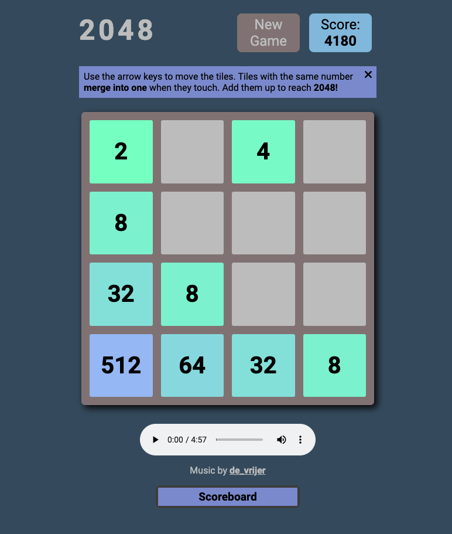

# game-project

## Project Overview

The purpose of this project was to create a game utilising skills in HTML, CSS/SCSS, and JavaScript.

## Design Approach

### HTML and SCSS/CSS

The basic UI was largely based off that of the original 2048 game, aiming to replicate the style the original game achieved. The HTML was manipulated using JavaScript.

Using media queries, when on a mobile or tablet with no proper mouse cursor available, arrow buttons appear on the interface in order to allow user interaction, even without a keyboard.

Throughout the project, GitHub was used for version control.

### JavaScript

The basic approach to the JavaScript was to use DOM interaction to manipulate a 2D array in the JavaScript. Changes in the JavaScript would be fed back to the DOM for visual representation in the UI.

## Links to project

### Deployed Site

https://samueljacobs98.github.io/game-project/

### GitHub Repo

https://github.com/samueljacobs98/game-project
